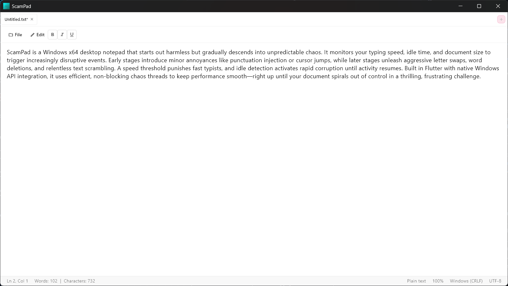
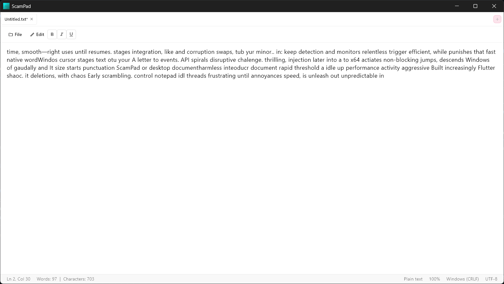

# ScamPad 🎯


## Basic Details
### Team Name: Vanguard


### Team Members
- Team Lead: Jeffin Basil - SCMS SCHOOL OF ENGINEERING & TECHNOLOGY
- Member 2: Adithya Manghat - SCMS SCHOOL OF ENGINEERING & TECHNOLOGY

### Project Description
"ScamPad" could be envisioned as a notepad application that looks normal but gradually scrambles, distorts, or modifies saved notes subtly (and sometimes not so subtly) over time!

### The Problem (that doesn't exist)
Notepad app is quite simple and convenient to use, but that's no fun right? 

### The Solution (that nobody asked for)
Give it a little personality and it'll help you "rephrase" your notes really well.

## Technical Details
### Technologies/Components Used
For Software:
- Dart, C++
- Flutter, Material Design 3
- flutter/material.dart, flutter/services.dart, file_picker, dart:io, dart:async, dart:math
- Visual Studio Code, Flutter SDK, CMake


### Implementation
For Software:
# Installation
```bash
# Install Flutter SDK
flutter doctor

# Clone the repository
git clone https://github.com/FALLEN-01/vanguard.git
cd vanguard

# Get dependencies
flutter pub get

# Enable Windows desktop
flutter config --enable-windows-desktop

# Verify setup
flutter doctor -v
```

# Run
```bash
# Development mode
flutter run -d windows

# Release build
flutter build windows

# Run executable
./build/windows/runner/Release/scampad.exe
```

### Project Documentation
For Software:

## Features

### Core Functionality
- **Multi-tab Text Editor**: Supports multiple documents with tab-based navigation
- **Native Windows Integration**: File dialogs, keyboard shortcuts, and system clipboard support
- **Real-time Statistics**: Live word count, character count, and line tracking
- **Auto-save Warning**: Prompts users before losing unsaved work

### Chaos Features 🎲
- **Progressive Chaos System**: Chaos intensity increases based on document word count
  - Under 40 words: Gentle disruptions (punctuation, spaces, cursor movement)
  - 40-59 words: Character manipulation begins (letter deletion, swapping)
  - 60+ words: Full chaos mode (word deletion, word swapping)

- **Speed-based Escalation**: Typing speed monitoring with escalating consequences
  - 65+ WPM triggers speed warnings
  - 4 violation system with sarcastic messages
  - Automatic shutdown after 4th violation

- **Idle Punishment**: After 10 seconds of inactivity, rapid word swapping begins
  - Continuous text scrambling until user resumes typing
  - 500ms interval rapid swapping for maximum disruption

### Chaos Actions
- **Letter Operations**: Random deletion, swapping within words
- **Word Operations**: Word deletion, inter-line word swapping
- **Punctuation Injection**: Smart placement at word boundaries only
- **Cursor Teleportation**: Random cursor repositioning
- **Indentation Chaos**: Random spacing and tab insertion
- **Space Addition**: Random whitespace injection

### User Interface
- **Modern Design**: Clean, Material Design 3 interface
- **Dark Theme**: Easy on the eyes during chaos events
- **Status Bar**: Real-time document statistics and modification indicators
- **Dialog Systems**: Speed warnings, subscription prompts, and shutdown notifications

## Architecture

### Class Structure
```
ChaosManager
├── Timer-based chaos scheduling (4-8 second intervals)
├── Word count-based action selection
├── Idle detection and rapid swapping
└── 13 different chaos methods

TypingSpeedMonitor  
├── Real-time keystroke tracking
├── Speed calculation (CPM/WPM)
├── Violation counter with persistence
└── Escalating warning system

ModernNotepadPage
├── Multi-tab document management
├── File operations (New, Open, Save, Save As)
├── Statistics tracking
└── UI state management

TabData
├── Individual document state
├── TextEditingController management
├── File path and modification tracking
└── Focus node handling
```

### Chaos Progression Logic
1. **Document Analysis**: Word count determines available chaos actions
2. **Random Selection**: Weighted probability system for action selection
3. **Speed Monitoring**: Continuous typing speed analysis
4. **Idle Detection**: 10-second countdown with rapid punishment
5. **State Persistence**: Violation counts persist throughout session

## Technical Implementation

### Key Components
- **Flutter Desktop**: Cross-platform UI framework targeting Windows
- **Native File System**: Direct Windows API integration for file operations
- **Timer Management**: Multiple concurrent timers for different chaos systems
- **Text Manipulation**: Advanced string processing for surgical text modifications
- **Event Handling**: Keyboard shortcuts and text change monitoring

### Performance Optimizations
- **Non-blocking Chaos**: All chaos operations run on separate timer threads
- **Efficient Text Operations**: Minimal string allocations during modifications
- **Smart Action Selection**: Context-aware chaos to avoid breaking functionality
- **Memory Management**: Proper timer cleanup and resource disposal

## Usage Scenarios

### Normal Usage (If Possible)
1. Open ScamPad like any text editor
2. Create or open text files
3. Experience "minor" inconveniences during typing
4. Save work frequently (before chaos strikes)

### Chaos Experience
1. **Early Stage**: Gentle disruptions, mostly cosmetic
2. **Mid Stage**: Noticeable text modifications, typing becomes challenging  
3. **Late Stage**: Full chaos mode, document becomes increasingly unstable
4. **Speed Violations**: Aggressive warnings, potential shutdown
5. **Idle Periods**: Relentless text scrambling until activity resumes

## Configuration

### Adjustable Parameters
- Chaos interval: 4-8 seconds (configurable in code)
- Speed threshold: 325 CPM / 65 WPM
- Idle timeout: 10 seconds
- Rapid swap interval: 500ms
- Word count thresholds: 40, 60 words

### Chaos Probabilities
**Stage 1 (< 40 words):**
- 40% Punctuation injection
- 30% Random spaces  
- 20% Cursor teleportation
- 10% Random indentation

**Stage 2 (40-59 words):**
- 35% Letter deletion
- 25% Letter swapping
- 15% Punctuation injection
- 12% Cursor teleportation
- 8% Random spaces
- 5% Random indentation

**Stage 3 (60+ words):**
- 30% Letter deletion
- 25% Letter swapping  
- 20% Word deletion
- 10% Word swapping
- 8% Punctuation injection
- 5% Random spaces
- 2% Random indentation

# Screenshots (Add at least 3)

*ScamPad's clean interface on startup - appears as a normal notepad application with multiple tabs, file operations, and a professional layout*


*After chaos mode activation - text becomes scrambled, words are swapped and deleted, demonstrating the progressive chaos system in action*

# Diagrams

## ScamPad Chaos Workflow
```
                                    ┌─────────────────┐
                                    │   User Opens    │
                                    │    ScamPad      │
                                    └─────────┬───────┘
                                              │
                                              ▼
                                    ┌─────────────────┐
                                    │  Initialize UI  │
                                    │   & Systems     │
                                    └─────────┬───────┘
                                              │
                                              ▼
                    ┌─────────────────────────────────────────────┐
                    │            Start Three Parallel Systems     │
                    └─────────┬───────────┬───────────┬───────────┘
                              │           │           │
                              ▼           ▼           ▼
                    ┌─────────────┐ ┌─────────────┐ ┌─────────────┐
                    │   Chaos     │ │   Speed     │ │    Idle     │
                    │   Manager   │ │  Monitor    │ │  Detector   │
                    │  (4-8 sec)  │ │ (Real-time) │ │ (10 sec)    │
                    └─────────────┘ └─────────────┘ └─────────────┘
                              │           │           │
                              ▼           ▼           ▼
                    ┌─────────────────────────────────────────────┐
                    │           USER TYPING ACTIVITY              │
                    └─────────────────┬───────────────────────────┘
                              │
                              ▼
                    ┌─────────────────┐      ┌─────────────────┐
                    │  Word Count     │      │   Speed Check   │
                    │   Analysis      │◄─────┤    ≥65 WPM?    │
                    └─────────┬───────┘      └─────────┬───────┘
                              │                        │
                    ┌─────────▼───────┐      ┌─────────▼───────┐
                    │   < 40 Words?   │      │  Speed Warning  │
                    │    Stage 1      │      │   Escalation    │
                    │ • Punctuation   │      │ • 4 Violations  │
                    │ • Spaces        │      │ • Shutdown      │
                    │ • Cursor Move   │      └─────────────────┘
                    └─────────┬───────┘
                              │
                    ┌─────────▼───────┐      ┌─────────────────┐
                    │  40-59 Words?   │      │   Idle Timer    │
                    │    Stage 2      │◄─────┤   10 seconds    │
                    │ • Letter Ops    │      └─────────┬───────┘
                    │ • + Stage 1     │                │
                    └─────────┬───────┘      ┌─────────▼───────┐
                              │              │  Rapid Swapping │
                    ┌─────────▼───────┐      │   Every 500ms   │
                    │   60+ Words?    │      │ Until Activity  │
                    │    Stage 3      │      └─────────────────┘
                    │ • Word Delete   │
                    │ • Word Swap     │
                    │ • Full Chaos    │
                    └─────────────────┘
```
*This diagram shows how ScamPad's three parallel chaos systems work together to progressively disrupt the user experience based on document length, typing speed, and activity level*


### Project Demo
# Video
[ScamPad Demo Video](Screenshots/ScamPad_final.mp4)
*This video demonstrates ScamPad's complete chaos system in action - from normal notepad functionality to progressive text scrambling, speed-based warnings, and idle-based rapid swapping*


## Team Contributions
- Jeffin Basil: Flutter app architecture, chaos system implementation, UI design, file operations
- Adithya Manghat: Chaos algorithms, speed monitoring system, testing, documentation

---
Made with ❤️ at TinkerHub Useless Projects 


